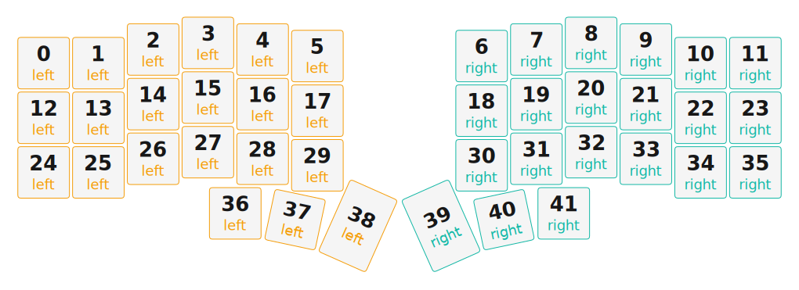

# ZMK Configuration for miiUnic

*Generated by Shield Wizard for ZMK*



Download compiled firmware from the Actions tab. <https://zmk.dev/docs/user-setup#installing-the-firmware>

Edit your keymap <https://zmk.dev/docs/keymaps>.
User keymap is located at [`config/miiunic.keymap`](config/miiunic.keymap).

-----

<details>
<summary>
Shield Wizard Debug Information
</summary>

In case of broken configuration, here is the Shield Wizard internal data used to generate this configuration:

Commit: 8a52249f61161469b6d90ed8c80c4aa52b9f3858

```json
{"name":"miiUnic","shield":"miiunic","dongle":false,"modules":[],"layout":[{"id":"01KHP370QV3NRKM73B280PPC9B","part":0,"row":0,"col":0,"w":1,"h":1,"x":0,"y":0.37,"r":0,"rx":0,"ry":0},{"id":"01KHP370QVR7E891T56RX31B6S","part":0,"row":0,"col":1,"w":1,"h":1,"x":1,"y":0.37,"r":0,"rx":0,"ry":0},{"id":"01KHP370QVK1FXYRH67Z2ZMKJY","part":0,"row":0,"col":2,"w":1,"h":1,"x":2,"y":0.12,"r":0,"rx":0,"ry":0},{"id":"01KHP370QV68J1ZK3Y6P16T6GP","part":0,"row":0,"col":3,"w":1,"h":1,"x":3,"y":0,"r":0,"rx":0,"ry":0},{"id":"01KHP370QVH2JESQP4FA6CC4H0","part":0,"row":0,"col":4,"w":1,"h":1,"x":4,"y":0.12,"r":0,"rx":0,"ry":0},{"id":"01KHP370QVJZWYWSN941X9SFPX","part":0,"row":0,"col":5,"w":1,"h":1,"x":5,"y":0.24,"r":0,"rx":0,"ry":0},{"id":"01KHP370QVAFVFCYNH6807VMQG","part":1,"row":0,"col":6,"w":1,"h":1,"x":8,"y":0.24,"r":0,"rx":0,"ry":0},{"id":"01KHP370QVA53QNE7A1FR81TPH","part":1,"row":0,"col":7,"w":1,"h":1,"x":9,"y":0.12,"r":0,"rx":0,"ry":0},{"id":"01KHP370QVQEHC154CAXD7Y4DT","part":1,"row":0,"col":8,"w":1,"h":1,"x":10,"y":0,"r":0,"rx":0,"ry":0},{"id":"01KHP370QV4FTDG6HS9TA0NCEK","part":1,"row":0,"col":9,"w":1,"h":1,"x":11,"y":0.12,"r":0,"rx":0,"ry":0},{"id":"01KHP370QVPZTP4KEZAY2045F2","part":1,"row":0,"col":10,"w":1,"h":1,"x":12,"y":0.37,"r":0,"rx":0,"ry":0},{"id":"01KHP370QVH05M4E81M1P7TJW6","part":1,"row":0,"col":11,"w":1,"h":1,"x":13,"y":0.37,"r":0,"rx":0,"ry":0},{"id":"01KHP370QV1N2NP4601A9EGDVH","part":0,"row":1,"col":0,"w":1,"h":1,"x":0,"y":1.37,"r":0,"rx":0,"ry":0},{"id":"01KHP370QV4RK5FZMKY5E909WG","part":0,"row":1,"col":1,"w":1,"h":1,"x":1,"y":1.37,"r":0,"rx":0,"ry":0},{"id":"01KHP370QVDESH4K0RHV70X77M","part":0,"row":1,"col":2,"w":1,"h":1,"x":2,"y":1.12,"r":0,"rx":0,"ry":0},{"id":"01KHP370QV9N788MX0QJ48TWR4","part":0,"row":1,"col":3,"w":1,"h":1,"x":3,"y":1,"r":0,"rx":0,"ry":0},{"id":"01KHP370QVB4BKCYT38HZDZEY1","part":0,"row":1,"col":4,"w":1,"h":1,"x":4,"y":1.12,"r":0,"rx":0,"ry":0},{"id":"01KHP370QV3C401SPY32M7Y1W7","part":0,"row":1,"col":5,"w":1,"h":1,"x":5,"y":1.24,"r":0,"rx":0,"ry":0},{"id":"01KHP370QVP7F4VPHDAN8DF5BX","part":1,"row":1,"col":6,"w":1,"h":1,"x":8,"y":1.24,"r":0,"rx":0,"ry":0},{"id":"01KHP370QVQT880XYVZ3Z6PRCT","part":1,"row":1,"col":7,"w":1,"h":1,"x":9,"y":1.12,"r":0,"rx":0,"ry":0},{"id":"01KHP370QVMR3NY28Q42R30GF0","part":1,"row":1,"col":8,"w":1,"h":1,"x":10,"y":1,"r":0,"rx":0,"ry":0},{"id":"01KHP370QV6RSVG1RB6XZPSWXP","part":1,"row":1,"col":9,"w":1,"h":1,"x":11,"y":1.12,"r":0,"rx":0,"ry":0},{"id":"01KHP370QVBYQTA2S0VD0V0ERF","part":1,"row":1,"col":10,"w":1,"h":1,"x":12,"y":1.37,"r":0,"rx":0,"ry":0},{"id":"01KHP370QV2S69CZKQYZ0HCA5K","part":1,"row":1,"col":11,"w":1,"h":1,"x":13,"y":1.37,"r":0,"rx":0,"ry":0},{"id":"01KHP370QVMW7BFSWKKXYN1KQQ","part":0,"row":2,"col":0,"w":1,"h":1,"x":0,"y":2.37,"r":0,"rx":0,"ry":0},{"id":"01KHP370QVB8BWDDGDKAFM9T0S","part":0,"row":2,"col":1,"w":1,"h":1,"x":1,"y":2.37,"r":0,"rx":0,"ry":0},{"id":"01KHP370QVD8595APQ3XJTJ728","part":0,"row":2,"col":2,"w":1,"h":1,"x":2,"y":2.12,"r":0,"rx":0,"ry":0},{"id":"01KHP370QV393MNTERKMX1HE4F","part":0,"row":2,"col":3,"w":1,"h":1,"x":3,"y":2,"r":0,"rx":0,"ry":0},{"id":"01KHP370QVGXAVYYJ7NF0WBSTT","part":0,"row":2,"col":4,"w":1,"h":1,"x":4,"y":2.12,"r":0,"rx":0,"ry":0},{"id":"01KHP370QVS1QPHF9JZ5MSAKJ0","part":0,"row":2,"col":5,"w":1,"h":1,"x":5,"y":2.24,"r":0,"rx":0,"ry":0},{"id":"01KHP370QV0J4Y4FFSBR2Y51WG","part":1,"row":2,"col":6,"w":1,"h":1,"x":8,"y":2.24,"r":0,"rx":0,"ry":0},{"id":"01KHP370QV3K8ZYJG8M4BD3JT9","part":1,"row":2,"col":7,"w":1,"h":1,"x":9,"y":2.12,"r":0,"rx":0,"ry":0},{"id":"01KHP370QV8N2Q5VYP37JMKQ2C","part":1,"row":2,"col":8,"w":1,"h":1,"x":10,"y":2,"r":0,"rx":0,"ry":0},{"id":"01KHP370QVRZ7MS3MQJC2025XE","part":1,"row":2,"col":9,"w":1,"h":1,"x":11,"y":2.12,"r":0,"rx":0,"ry":0},{"id":"01KHP370QV03G1RE97T8GVADBA","part":1,"row":2,"col":10,"w":1,"h":1,"x":12,"y":2.37,"r":0,"rx":0,"ry":0},{"id":"01KHP370QV14CFFECVP7WXPJ81","part":1,"row":2,"col":11,"w":1,"h":1,"x":13,"y":2.37,"r":0,"rx":0,"ry":0},{"id":"01KHP370QV7YYWEHC4870J18CW","part":0,"row":3,"col":3,"w":1,"h":1,"x":3.5,"y":3.12,"r":0,"rx":0,"ry":0},{"id":"01KHP370QV61V9JX6GW8WN4GAA","part":0,"row":3,"col":4,"w":1,"h":1,"x":4.5,"y":3.12,"r":12,"rx":4.5,"ry":4.12},{"id":"01KHP370QVWW3XM8W6C5J12WVT","part":0,"row":3,"col":5,"w":1,"h":1.5,"x":5.48,"y":2.83,"r":24,"rx":5.48,"ry":4.33},{"id":"01KHP370QVDF4W794AC7DY714F","part":1,"row":3,"col":6,"w":1,"h":1.5,"x":7.52,"y":2.83,"r":-24,"rx":8.52,"ry":4.33},{"id":"01KHP370QVPEEGS1RVY0194FTZ","part":1,"row":3,"col":7,"w":1,"h":1,"x":8.5,"y":3.12,"r":-12,"rx":9.5,"ry":4.12},{"id":"01KHP370QV3WXVZCPYWHKV12AH","part":1,"row":3,"col":8,"w":1,"h":1,"x":9.5,"y":3.12,"r":0,"rx":0,"ry":0}],"parts":[{"name":"left","controller":"nice_nano_v2","wiring":"matrix_diode","keys":{"01KHP370QV3NRKM73B280PPC9B":{"input":"d14","output":"d5"},"01KHP370QVR7E891T56RX31B6S":{"input":"d15","output":"d5"},"01KHP370QVK1FXYRH67Z2ZMKJY":{"input":"d18","output":"d5"},"01KHP370QV68J1ZK3Y6P16T6GP":{"input":"d19","output":"d5"},"01KHP370QVH2JESQP4FA6CC4H0":{"input":"d20","output":"d5"},"01KHP370QVJZWYWSN941X9SFPX":{"input":"d21","output":"d5"},"01KHP370QV7YYWEHC4870J18CW":{"output":"d8","input":"d19"},"01KHP370QV61V9JX6GW8WN4GAA":{"output":"d8","input":"d20"},"01KHP370QVWW3XM8W6C5J12WVT":{"output":"d8","input":"d21"},"01KHP370QVMW7BFSWKKXYN1KQQ":{"output":"d7","input":"d14"},"01KHP370QVB8BWDDGDKAFM9T0S":{"output":"d7","input":"d15"},"01KHP370QVD8595APQ3XJTJ728":{"output":"d7","input":"d18"},"01KHP370QV393MNTERKMX1HE4F":{"output":"d7","input":"d19"},"01KHP370QVGXAVYYJ7NF0WBSTT":{"output":"d7","input":"d20"},"01KHP370QVS1QPHF9JZ5MSAKJ0":{"output":"d7","input":"d21"},"01KHP370QV1N2NP4601A9EGDVH":{"output":"d6","input":"d14"},"01KHP370QV4RK5FZMKY5E909WG":{"output":"d6","input":"d15"},"01KHP370QVDESH4K0RHV70X77M":{"output":"d6","input":"d18"},"01KHP370QV9N788MX0QJ48TWR4":{"output":"d6","input":"d19"},"01KHP370QVB4BKCYT38HZDZEY1":{"output":"d6","input":"d20"},"01KHP370QV3C401SPY32M7Y1W7":{"output":"d6","input":"d21"}},"encoders":[],"pins":{"d21":"input","d20":"input","d19":"input","d18":"input","d15":"input","d14":"input","d8":"output","d7":"output","d6":"output","d5":"output","d3":"bus","d2":"bus","d4":"bus"},"buses":[{"type":"spi","name":"spi0","devices":[{"type":"niceview","cs":"d4"}],"sck":"d3","mosi":"d2"},{"type":"spi","name":"spi1","devices":[]},{"type":"spi","name":"spi2","devices":[]},{"type":"spi","name":"spi3","devices":[]},{"type":"i2c","name":"i2c0","devices":[]},{"type":"i2c","name":"i2c1","devices":[]}]},{"name":"right","controller":"nice_nano_v2","wiring":"matrix_diode","keys":{"01KHP370QVH05M4E81M1P7TJW6":{"input":"d14","output":"d5"},"01KHP370QV2S69CZKQYZ0HCA5K":{"input":"d14","output":"d6"},"01KHP370QV14CFFECVP7WXPJ81":{"input":"d14","output":"d7"},"01KHP370QVPZTP4KEZAY2045F2":{"input":"d15","output":"d5"},"01KHP370QVBYQTA2S0VD0V0ERF":{"input":"d15","output":"d6"},"01KHP370QV03G1RE97T8GVADBA":{"input":"d15","output":"d7"},"01KHP370QV4FTDG6HS9TA0NCEK":{"input":"d18","output":"d5"},"01KHP370QV6RSVG1RB6XZPSWXP":{"input":"d18","output":"d6"},"01KHP370QVRZ7MS3MQJC2025XE":{"input":"d18","output":"d7"},"01KHP370QVQEHC154CAXD7Y4DT":{"input":"d19","output":"d5"},"01KHP370QVMR3NY28Q42R30GF0":{"input":"d19","output":"d6"},"01KHP370QV8N2Q5VYP37JMKQ2C":{"input":"d19","output":"d7"},"01KHP370QV3WXVZCPYWHKV12AH":{"input":"d19","output":"d8"},"01KHP370QVA53QNE7A1FR81TPH":{"input":"d20","output":"d5"},"01KHP370QVQT880XYVZ3Z6PRCT":{"input":"d20","output":"d6"},"01KHP370QV3K8ZYJG8M4BD3JT9":{"input":"d20","output":"d7"},"01KHP370QVPEEGS1RVY0194FTZ":{"input":"d20","output":"d8"},"01KHP370QVAFVFCYNH6807VMQG":{"input":"d21","output":"d5"},"01KHP370QVP7F4VPHDAN8DF5BX":{"input":"d21","output":"d6"},"01KHP370QV0J4Y4FFSBR2Y51WG":{"input":"d21","output":"d7"},"01KHP370QVDF4W794AC7DY714F":{"input":"d21","output":"d8"}},"encoders":[],"pins":{"d21":"input","d20":"input","d19":"input","d18":"input","d15":"input","d14":"input","d8":"output","d7":"output","d6":"output","d5":"output","d2":"bus","d3":"bus","d4":"bus"},"buses":[{"type":"spi","name":"spi0","devices":[{"type":"niceview","cs":"d4"}],"mosi":"d2","sck":"d3"},{"type":"spi","name":"spi1","devices":[]},{"type":"spi","name":"spi2","devices":[]},{"type":"spi","name":"spi3","devices":[]},{"type":"i2c","name":"i2c0","devices":[]},{"type":"i2c","name":"i2c1","devices":[]}]}]}
```

</details>
